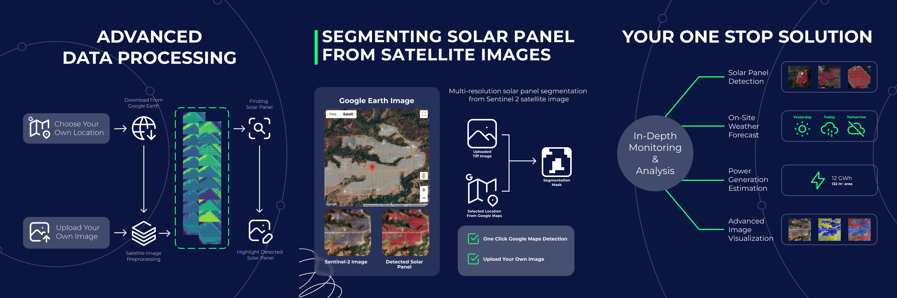
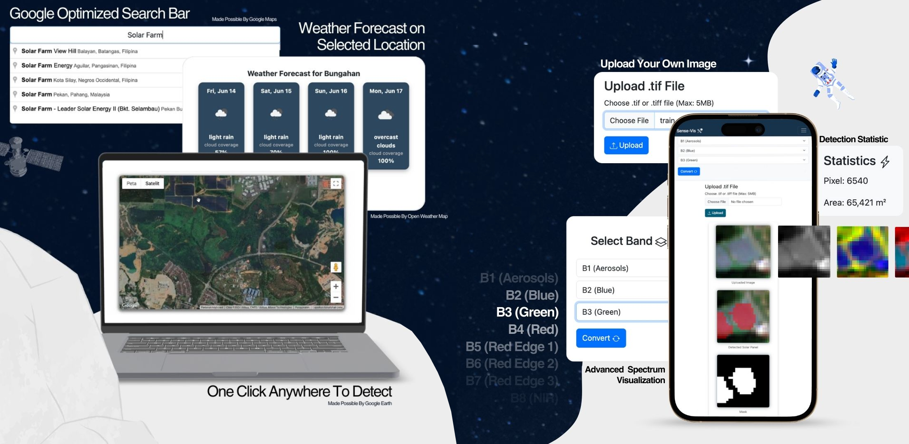
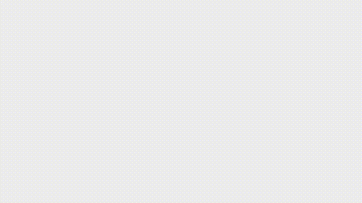
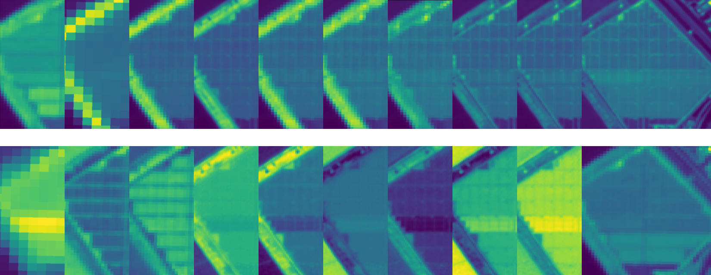

# Solar Panel Segmentation Using YOLOv5

### Project for Bangkit Company Capstone with Solafune

This project utilizes the Solafune "Solar Panel Detection Using Sentinel-2" dataset. The dataset consists of 2066 training images and 2066 evaluation images. For more information, please visit the [Solafune Competition Page](https://solafune.com/competitions/5dfc315c-1b24-4573-804f-7de8d707cd90) by clicking the image below.

[](https://solafune.com/competitions/5dfc315c-1b24-4573-804f-7de8d707cd90)

> The dataset can be downloaded from the competition page.

## Project Creator

Hello, our creator consist of 4 people, Muhammad Rafly Arjasubrata (Telkom University), Muhammad Abiya Makruf (Telkom University), Muhammad Daffa Irfani (Telkom University), and Riyang Syahartati (Diponegoro University). At the time of this project, We are in our 6th-semester with a keen interest in Computer Vision-based Machine Learning. You can connect with us by clicking the icons below.

| [LinkedIn - Muhammad Rafly Arjasubrata](https://www.linkedin.com/in/raflyarj/) | [LinkedIn - Muhammad Daffa Irfani](https://www.linkedin.com/in/muhammad-daffa-irfani/) | [LinkedIn - Abiyama Makruf](https://www.linkedin.com/in/abiyamakruf/) | [LinkedIn - Riyang Syahartati](https://www.linkedin.com/in/risyatati2003/) |
|:---------------------------------------------------------------------------------:|:-------------------------------------------------------------------------------:|:----------------------------------------------------------------------------:|:--------------------------------------------------------------------------:|

# Project Background

This project was chosen to implement a fast segmentation model for real-life scenarios. Compared to U-Net based models, YOLO-based models offer faster inference times.

## Why YOLOv5?

YOLOv5 was chosen as it is the latest *open-source* model provided by Ultralytics. Initially, YOLOv8 was considered, but it does not support multi-channel satellite images with more than 3 channels. Therefore, YOLOv5 was selected for its customizability to handle images with more than 3 channels.

## Scope of the Code

The code in this repository covers preprocessing, training, and evaluation of the dataset for submission to the Solafune competition. Download and extract the dataset, then structure it as detailed in the [File Structure](#file-structure) section.

## Sense-Vis

This project is part of a larger project called "Sense-Vis," a responsive website for detecting solar panels using the YOLOv5 model. The website offers accurate detection by analyzing Sentinel-2 imagery from Google Earth and user-uploaded TIFF files.

### Sense-Vis Features




#### Detect Anywhere from Google Earth
The website integrates with Google Earth, allowing users to click anywhere on the map to detect the presence of solar panels.

#### Upload Your Own Images
Users can upload their own Sentinel-2 satellite images for solar panel detection.

#### Location Search Bar
The integrated search bar, powered by Google Maps data, enables quick location searches.

#### Advanced Spectrum Visualization
Users can select and visualize the spectrum of chosen images to analyze unique properties.

#### Integrated Weather Forecast
The website uses the [OpenWeatherMap](https://openweathermap.org/) API to provide a 3-day weather forecast for the selected location.

### Sense-Vis Demo



# File Structure

This repository includes the preprocessing, training, and evaluation pipeline, along with a modified YOLOv5 to accommodate 20 channels. Download the train and evaluation dataset and extract it according to the structure below.

### Project Folder Structure


```
project/
├── dataset/ # Contain the datasets from solafune
│ ├── evaluation/
│ │ ├── mask/
│ │ │ ├── evaluation_mask_0.tif
│ │ │ └── ...
│ │ └── s2_image/
│ │   ├── evaluation_s2_image_0.tif
│ │   └── ...
│ |
│ └── train/
│   ├── mask/
│   │ ├── evaluation_mask_0.tif
│   │ └── ...
│   └── s2_image/
│     ├── evaluation_s2_image_0.tif
│     └── ...
│
├── masks/ # Contain the mask to be submitted to solafune
│ └── {data_name}/
│   ├── evaluation_mask_0.tif
│   └── ...
│
├── preprocessed_data/ # Contain .tif preprocessed data
│ └── {data_name}/
│   ├── evaluation/ # Preprocessed Eval Images
│   │ ├── images/
│   │ │ ├── evaluation_s2_image_0.tif
│   │ │ └── ...
│   │ └── labels/ # YOLO Converted Labels
│   │   ├── evaluation_s2_image_0.txt
│   │   └── ...
│   ├── train/ # Preprocessed Train Images
│   │ ├── images/
│   │ │ ├── train_s2_image_0.tif
│   │ │ └── ...
│   │ └── labels/ # YOLO Converted Labels
│   │   ├── train_s2_image_0.txt
│   │   └── ...
│
├── train_data/ # Contain folds of images for CV and eval images + YOLO Configs
│ └── {data_name}/
│   ├── configs/ # Preprocessed Eval Images
│   │ ├── evaluation.yaml # Config for evaluation images
│   │ ├── fold_1.yaml # Config for each fold
│   │ └── ... # More config for each fold
│   ├── evaluation/ # Preprocessed Eval Images Connected to YAML
│   │ ├── images/
│   │ │ ├── evaluation_s2_image_0.tif
│   │ │ └── ...
│   │ └── labels/ # YOLO Converted Labels
│   │   ├── evaluation_s2_image_0.txt
│   │   └── ...
│   ├── fold_1/ # Training and Validation data for 1 fold
│   │ ├── train/
│   │ │ ├── images/ # Train Images & Labels
│   │ │ │ ├── evaluation_s2_image_0.tif
│   │ │ │ └── ...
│   │ │ └── labels
│   │ │   ├── evaluation_s2_image_0.txt
│   │ │   └── ...
│   │ └── val/ # Validation Images & Labels
│   │   ├── images/
│   │   │ ├── evaluation_s2_image_0.tif
│   │   │ └── ...
│   │   └── labels
│   │     ├── evaluation_s2_image_0.txt
│   │     └── ...
│   ├── fold_../ # More fold data
│
└── train_yolov5.ipynb
```

### Dataset Folder Structure

```
├── dataset/                         sample.zip
│ ├── evaluation/            ┌-------> └── sample/
│ │ ├── mask/  <-------------┘           ├── evaluation_mask_0.tif
│ │ │ ├── evaluation_mask_0.tif          └── ...
│ │ │ └── ...                        evaluation.zip
│ │ └── s2_image/ <------------------> └── evaluation/
│ │   ├── evaluation_s2_image_0.tif      ├── evaluation_s2_image_0.tif
│ │   └── ...                            └── ...
│ |                                  train.zip
│ └── train/ <-----------------------> └── train/
│   ├── mask/                            ├── images/
│   │ ├── evaluation_mask_0.tif          │ ├── train_s2_image_0.tif
│   │ └── ...                            │ └── ...
│   └── s2_image/                        └── labels/
│     ├── evaluation_s2_image_0.tif        ├── train_mask_0.tif
│     └── ...                              └── ...
```


1. **train.zip**
    
    Extract the `train.zip` file inside the dataset folder. The `train.zip` file should contain the folders named `s2_image` and `mask`.

2. **evaluation.zip**

    Extract the `evaluation.zip` file and **rename** the folder containing the evaluation images from `evaluation` to `s2_image`. Place this `s2_image` folder inside the `evaluation` folder.

3. **sample.zip**

   Extract the `sample.zip` file and **rename** the folder containing the dummy evaluation masks from `sample` to `mask`. Place this `mask` folder inside the `evaluation` folder.

The pipeline automatically reads and extracts both the images and masks from this folder structure.

## Predefined File and Folder

Certain folders need to be present before starting the training.

1. **dataset**

    This folder contains the raw images and masks from the Solafune dataset, which can be downloaded from the competition page on the Solafune website.

2. **yolov5**

    This folder contains a modified YOLOv5 that accepts 20-channel images, based on the YOLOv5 repository from Ultralytics.

## Generated File and Folder

These folders are generated by the pipeline and YOLOv5.

1. **preprocessed_data**

    This folder contains the preprocessed images of the training and evaluation dataset. The masks in the training dataset will be converted to YOLO labels in .txt format. The evaluation dummy masks will be converted to empty .txt labels.

2. **train_data**

    This folder contains the training data that YOLOv5 will read. It includes data for each fold, the evaluation data, and configuration files for evaluation and each fold.

3. **masks**

    This folder contains the mask results from the evaluation set, formatted for Solafune submission.


# Image & Mask Processing Step

There are several preprocessing steps to improve detection accuracy and match the format that YOLOv5 accepts. This pipeline will handle the preprocessing of both the training and evaluation datasets. Additionally, the pipeline will convert binary label masks to the YOLO .txt label format. The processing includes the following steps:

## Channel Extraction
The first step is to select the channels from the image. The first 12 channels are selected from the .tif image, as these are essential bands for land monitoring. The dataset from Solafune contains 12 channels. Note that the .tif images collected from Google services contain 23 channels. For the data from Google, only the first 12 channels are selected.

The dataset has a pixel range of $[0, 10000]$, with some pixel values exceeding 10000. For pixel values above 10000, they will be clipped to 10000. Note that the .tif images collected from Google services have a pixel range of $[0, 1]$, so these must be multiplied by 10000 before further preprocessing.

Each channel is normalized using min-max normalization $(\frac{\text{pixel} - \text{min}}{\text{max} - \text{min}}) \times 255$ with $\text{min} = 0$ and $\text{max} = 10000$. The normalized image will have a range of $[0, 255]$ with float32 precision.

## Channel Creation
A new channel is created from a normalized difference index between two specific spectral bands. The ratio is calculated with the formula $\frac{A-B}{A+B}$, where A and B are the respective bands. A total of eight new channels are created using this formula from several permutations of the bands. Six new channels are created from permutations of bands 2, 3, and 4, and two more channels are created from permutations of bands 10 and 11.

| (2, 3, 4) | (10, 11) |
|-----------|----------|
| (2, 3)    | (10, 11) |
| (3, 2)    | (11, 10) |
| (2, 4)    | -        |
| (4, 2)    | -        |
| (3, 4)    | -        |
| (4, 3)    | -        |

The resulting calculation will be in a range of [-1, 1]. After the calculation, the new channel is also normalized using min-max normalization $(\frac{\text{pixel} - \text{min}}{\text{max} - \text{min}}) \times 255$ with $\text{min} = -1$ and $\text{max} = 1$, resulting in a pixel range of $[0, 255]$ with float32 precision.

The new channel will be stacked onto the normalized original channel, so each image will have 20 channels with a pixel range of $[0, 255]$ with float32 precision.



## Rescale
Before exporting the image, it will be scaled 10 times using `linear` interpolation. Other methods of interpolation, such as `bicubic` and `nearest neighbor` interpolation, were tried, but `linear` interpolation was found to be the best suited for this case.

The image is scaled 10 times because the image size is mostly around 23-25 pixels, so it will closely match the input size of $256 \times 256$. Further resizing to match the input size will be done inside the Ultralytics YOLOv5 code.

> For the Sentinel-2 images from Google, the image size is closely matched during the fetching and downloading phase from Google, so no further scaling is needed for those images.

The rescaled image is saved in the `preprocessed_data` folder in .tif format with float32 precision.

## Convert Mask to YOLO Format
A function for reading the binary mask is created. The function resizes the mask first using the same scale factor and interpolation. After that, `cv2.threshold` is applied with a threshold of `0`, so pixels with a value of 0 will remain 0, and pixels with a value greater than 0 will be turned into 255. The mask is converted using `cv2.findContours` with the code below:

```python
contours, hierarchy = cv2.findContours(mask, cv2.RETR_EXTERNAL, cv2.CHAIN_APPROX_SIMPLE)

polygons = []
for cnt in contours:
    if cv2.contourArea(cnt) > 0:
        polygon = []
        for point in cnt:
            x, y = point[0]
            polygon.append(x / W)
            polygon.append(y / H)
        polygons.append(polygon)
```

The polygon values are normalized by the mask width and height, as normalized labels are required by YOLOv5. The result is then written to a .txt format with the same file name as the corresponding image.

For example, `train_s2_image_0.tif` will have a label file named `train_s2_image_0.txt`.

## Mask Extraction for Evaluation Dataset
The mask is extracted using `evaluation.py`, which is a duplicate of `val.py` with added mask extraction functionality. The mask will be written to the `masks` folder with the original mask size.

The mask will be formatted according to the Solafune submission format, with only 0 and 1 values. The mask is downscaled from the preprocessed size to the original size using nearest neighbor interpolation to match the original size.

# Changes to Accomodate 20 Channels Image
Here are some changes in the YOLOv5 source code to accomodate the 20 channels image.

### data/hyps.hyp.scratch-low.yaml
this is the config containing the training parameter and augmentation parameter. The config below is the new parameter used in training

```
lr0: 0.0005 # initial learning rate (SGD=1E-2, Adam=1E-3)
lrf: 0.0005 # final OneCycleLR learning rate (lr0 * lrf)
momentum: 0.937 # SGD momentum/Adam beta1
weight_decay: 0.0005 # optimizer weight decay 5e-4
warmup_epochs: 3.0 # warmup epochs (fractions ok)
warmup_momentum: 0.8 # warmup initial momentum
warmup_bias_lr: 0.1 # warmup initial bias lr
box: 0.05 # box loss gain
cls: 0.5 # cls loss gain
cls_pw: 1.0 # cls BCELoss positive_weight
obj: 1.0 # obj loss gain (scale with pixels)
obj_pw: 1.0 # obj BCELoss positive_weight
iou_t: 0.40 # IoU training threshold
anchor_t: 4.0 # anchor-multiple threshold
# anchors: 3  # anchors per output layer (0 to ignore)
fl_gamma: 0.0 # focal loss gamma (efficientDet default gamma=1.5)
hsv_h: 0 # image HSV-Hue augmentation (fraction)
hsv_s: 0 # image HSV-Saturation augmentation (fraction)
hsv_v: 0 # image HSV-Value augmentation (fraction)
degrees: 0 # image rotation (+/- deg)
translate: 0.1 # image translation (+/- fraction)
scale: 0.5 # image scale (+/- gain)
shear: 0 # image shear (+/- deg)
perspective: 0.0 # image perspective (+/- fraction), range 0-0.001
flipud: 0.5 # image flip up-down (probability)
fliplr: 0.5 # image flip left-right (probability)
mosaic: 0.2 # image mosaic (probability)
mixup: 0.0 # image mixup (probability)
copy_paste: 0.0 # segment copy-paste (probability)
```

Updated training parameters and augmentation settings to stabilize the training of multispectral images :
- **Learning Rate**: Set lower `lr0: 0.005` to make training more stable.
- **Augmentation**: Disabling HSV augmentation and Mixup to avoid unrealistic spectral changes.

### models/common.py
```
744     def warmup(self, imgsz=(1, 20, 256, 256)):
745         """Performs a single inference warmup to initialize model weights, accepting an `imgsz` tuple for image size."""
746         warmup_types = self.pt, self.jit, self.onnx, self.engine, self.saved_model, self.pb, self.triton
747         if any(warmup_types) and (self.device.type != "cpu" or self.triton):
748             im = torch.empty(*imgsz, dtype=torch.half if self.fp16 else torch.float, device=self.device)  # input
749             for _ in range(2 if self.jit else 1):  #
750                 self.forward(im)  # warmup
```

Line `744` has been updated to specify the new imgsz parameter as `(1, 20, 256, 256)`. This adjustment allows the warmup function to initialize the model with a single image sized $256 \times 256$ pixels and consisting of 20 channels, suited for 20-channel multispectral input.

```
857     if im.shape[0] < 5:  # image in CHW
858         im = im.transpose((1, 2, 0))  # reverse dataloader .transpose(2, 0, 1)
859     # im = im[..., :3] if im.ndim == 3 else cv2.cvtColor(im, cv2.COLOR_GRAY2BGR)  # enforce 3ch input
860     s = im.shape[:2]  # HWC
861     shape0.append(s)  # image shape
```

The code on line `859` that enforces 3-channel input has been commented out to support the new 20-channel configuration.

### models/segment/yolov5-seg.yaml
```
nc: 80 # number of classes
ch: 20 # Num of image channel
depth_multiple: 1.0 # model depth multiple
width_multiple: 1.0 # layer channel multiple
```

In the all of the YOLOv5-seg architecture configuration, the parameter `ch` has been set to 20 to specify the number of input channels used.

### segment/predict.py
```
131     # Run inference
132     model.warmup(imgsz=(1 if pt else bs, 20, *imgsz))  # warmup
133     seen, windows, dt = 0, [], (Profile(device=device), Profile(device=device), Profile(device=device))
```

The `imgsz` parameter in the warmup call on line `131` has been updated to `(batch, 20, width, height)`, setting the number of channels to 20.

### segment/train.py
```
184     else:
185         model = SegmentationModel(cfg, ch=20, nc=nc, anchors=hyp.get("anchors")).to(device)  # create
186     amp = check_amp(model)  # check AMP
```

The `ch`parameter has been set to 20 on line `185` to initialize the SegmentationModel with 20 channels.

### utils/segment/plots.py
```
32      # Extract RGB channels (Red : -4, Green : -3, Blue: -2)
33      images = images[:, [-4, -3, -2], :, :]
34
35      # Min-max normalization for each channel
36      for i in range(3):
37          channel = images[:, i, :, :]
38          min_val = channel.min(axis=(1, 2), keepdims=True)
39          max_val = channel.max(axis=(1, 2), keepdims=True)
40          images[:, i, :, :] = (channel - min_val) / (max_val - min_val + 1e-8)
```

Lines `32-40` have been added to extract and normalize the RGB spectrum for visualization of the segmentation results.

### utils/augmentation.py
```
def letterbox(im, new_shape=(640, 640), color=(114,) * 12, auto=True, scaleFill=False, scaleup=True, stride=32):
    """Resizes and pads 12-channel multispectral image to new_shape with stride-multiple constraints,
    returns resized image, ratio, padding."""

    # Set the color of padding times the channel counts
    color = (144,) * im.shape[2]

    shape = im.shape[:2]  # current shape [height, width]
    if isinstance(new_shape, int):
        new_shape = (new_shape, new_shape)

    # Scale ratio (new / old)
    r = min(new_shape[0] / shape[0], new_shape[1] / shape[1])
    if not scaleup:  # only scale down, do not scale up (for better val mAP)
        r = min(r, 1.0)

    # Compute padding
    ratio = r, r  # width, height ratios
    new_unpad = int(round(shape[1] * r)), int(round(shape[0] * r))
    dw, dh = new_shape[1] - new_unpad[0], new_shape[0] - new_unpad[1]  # width, height padding
    if auto:  # minimum rectangle
        dw, dh = np.mod(dw, stride), np.mod(dh, stride)  # width, height padding
    elif scaleFill:  # stretch
        dw, dh = 0.0, 0.0
        new_unpad = (new_shape[1], new_shape[0])
        ratio = new_shape[1] / shape[1], new_shape[0] / shape[0]  # width, height ratios

    dw /= 2  # divide padding into 2 sides
    dh /= 2

    if shape[::-1] != new_unpad:  # resize
        im = cv2.resize(im, new_unpad, interpolation=cv2.INTER_LINEAR)

    top, bottom = int(round(dh - 0.1)), int(round(dh + 0.1))
    left, right = int(round(dw - 0.1)), int(round(dw + 0.1))
    padded_im = np.full((new_shape[0], new_shape[1], im.shape[2]), color, dtype=im.dtype)
    padded_im[top:top + new_unpad[1], left:left + new_unpad[0], :] = im

    return padded_im, ratio, (dw, dh)
```

The `letterbox` function has been adjusted to resize and pad multichannel images appropriately.

### utils/dataloaders.py
```
28  import tifffile as tiff
```
import tifffile module to read .tif files.

```
392     if path.endswith('.tif') :
393         im0 = tiff.imread(path)  # TIF
394     elif path.endswith('.jpg') :
395         im0 = cv2.imread(path) # BGR
...
704     im = tiff.imread(random.choice(self.im_files))
...
860     im = tiff.imread(f)
...
875     np.save(f.as_posix(), tiff.imread(self.im_files[i]))
...
1082    im = tiff.imread(str(im_file))[..., ::-1]
...
1252    im = tiff.imread(f)
...
1338    im = self.samples[i][3] = tiff.imread(f)
...
1341    np.save(fn.as_posix(), tiff.imread(f))
...
1344    im = tiff.imread(f) # BGR
```
Replace `cv2.imread()` with `tiff.imread()` in the dataloader to support reading `.tif` files.

```
865         # Hard Coded the interpolation to nearest neighbor
866         interp = cv2.INTER_NEAREST if (self.augment or r > 1) else cv2.INTER_NEAREST
867         im = cv2.resize(im, (math.ceil(w0 * r), math.ceil(h0 * r)), interpolation=cv2.INTER_NEAREST)
```
Change the rescale interpolation to `nearest neighbor` to preserve low-resolution pixel detail

```
890     img4 = np.full((s * 2, s * 2, img.shape[2]), 114, dtype=np.float32)
952     img9 = np.full((s * 3, s * 3, img.shape[2]), 114, dtype=np.float32)
```
Convert the image to `float32` precision

```
1388    # verify tiff images
1389    im = tiff.imread(im_file)
1340
1341    # Checking if the tiff image have atleast 3 channels
1342    if im.shape[2] < 3 :
1343        raise ValueError(f"Expected image with more than 3 channels, but got {im.shape}")
1344
1345    shape = im.shape[:2]  # image size
```
Modify the data verifier to accept `.tif` files.

### segment/evaluation.py
```
def save_mask(pred_masks, path) :
    '''
    Save the mask with the original size
    '''
    file_name = os.path.basename(path).replace('s2_image', 'mask')
    data_name = os.path.normpath(path).split(os.sep)[-4]
    h, w, c = tiff.imread(path).shape

    evaluation_path = os.path.join(os.getcwd(), 'dataset', 'evaluation', 'mask', file_name)
    o_h, o_w, = tiff.imread(evaluation_path).shape
    
    binary_mask = create_binary_mask(pred_masks)
    binary_mask = crop_mask(binary_mask, 0.05, o_h, o_w)
    binary_mask = cv2.resize(binary_mask, (o_w, o_h), interpolation=cv2.INTER_NEAREST)

    # Save the mask
    save_path = os.path.join(os.getcwd(), 'masks', data_name, file_name)
    tiff.imwrite(save_path, binary_mask)
```
A new function is added for saving the mask with the original size with 0 and 1 values for solafune submission

```
def crop_mask(binary_mask, crop_margin, h, w) :
    # Scale down the binary mask

    binary_mask = cv2.resize(binary_mask, (int(w), int(h)), interpolation=cv2.INTER_NEAREST)

    # Define the crop size with center anchor point
    crop_margin_w = ceil(w * crop_margin)
    crop_margin_h = ceil(h * crop_margin)

    x1, y1 = crop_margin_w, crop_margin_h
    x2, y2 = w - x1, h - y1

    binary_mask = binary_mask[y1:y2, x1:x2]
    
    # Rescale back to original size
    binary_mask = cv2.resize(binary_mask, (w, h), interpolation=cv2.INTER_NEAREST)

    # Return cropped Binary Mask
    return binary_mask

def create_binary_mask(pred_mask) :
    binary_mask = torch.zeros(pred_mask.shape[1:], dtype=torch.float32)

    for mask in pred_mask.cpu() :
        binary_mask = torch.max(binary_mask, mask)

    binary_mask = binary_mask.numpy().astype(np.uint8)

    return binary_mask
```
Functions above is a helper function to save the mask

```
387 # Save the Mask
388 save_mask(pred_masks, paths[si])
```
The save_mask is called in line `388`. 1 function call only save a single mask.

# Pipeline Parameter

There are two parameters that can be changed: the data parameter and the training parameter. The data parameter consists of a model size and the data name.

## Data Parameter
```
model = "yolov5l-seg.yaml"  # Architecture recipe
data_name = "restructured_l"  # Dataset name
fold = 5  # CV fold

train_image_path = 'dataset/train/s2_image/'  # Train image path
train_label_path = 'dataset/train/mask/'  # Train label path

evaluation_image_path = 'dataset/evaluation/s2_image/'  # Evaluation image path
evaluation_label_path = 'dataset/evaluation/mask/'  # Evaluation label path
```

1. **model**

    This parameter is for choosing the YOLOv5 architecture. There are several architectures to choose from, with sizes ranging from `nano` to `extra-large`. For details on architecture sizes and general performance, visit the Ultralytics YOLOv5 official repository. The architecture recipes are located in:

    `yolov5/models/segment/`

    Several architectures are available:
    
    |Recepie Name|Size|
    |------------|----|
    |yolov5n-seg.yaml|Nano|
    |yolov5s-seg.yaml|Small|
    |yolov5m-seg.yaml|Medium|
    |yolov5l-seg.yaml|Large|
    |yolov5x-seg.yaml|Extra-Large|

2. **data_name**

    The data name differentiates between different preprocessed data, models, and evaluation results. Multiple sets of preprocessed data, models, and evaluation results can be stored simply by changing the data name for each run.
    
    > Ensure you change `data_name` for each run.

3. **train & label path**

    The default train and evaluation paths are suitable for the folder structure above. However, if a different path is required, it can be specified here.

### Training Parameter

```
# Config for the model size, defined at the beginning of the code
model_config_path = os.path.join(wd, 'yolov5', 'models', 'segment', model)
# Config for the train data (fold_1 of the data name is the default)
data_path = os.path.join(wd, 'train_data', data_name, 'configs', 'fold_1.yaml')

!python yolov5/segment/train.py \
    --img 256 \
    --batch 128 \
    --epochs 300 \
    --data {data_path} \
    --cfg {model_config_path} \
    --device {gpu_num} \
    --no-overlap \
    --optimizer AdamW \
    --patience 300 \
    --name {data_name}
```

1. **Model Config & Data Path**

    The `model_config_path` variable is the path to the YOLOv5-seg recipe defined in the data parameter. This path can be changed if there is a custom recipe outside the default YOLOv5 architecture recipes.

2. **img**

    The `img` parameter specifies the input size of the model. The input size used is $256 \times 256$. The image size can be changed in multiples of 32.

3. **epochs**

    Epochs specify how many iterations the model will be trained.

4. **device**

    The `device` parameter refers to the GPU number on which the model will be trained. This is useful if multiple GPUs are available.

5. **no-overlap**

    This parameter ensures that each pixel can belong to only one object instance. Because there is only one class, this allows the model to minimize overlapping masks.

6. **optimizer**

    The optimizer used is `AdamW`. Several optimizers available in the utilities can be chosen, including `SGD`, `Adam`, `RMSprop`, and `AdamW`.

7. **patience**

    The `patience` parameter specifies the number of epochs to wait for validation loss improvement before terminating training. The patience number is set to be the same as the epoch number to prevent early stopping.

# Models Result